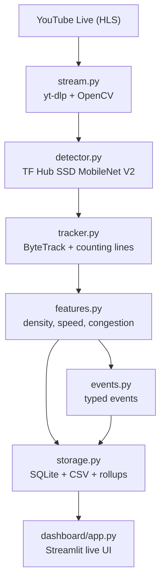

# Project Overview — Presentation Prep

Plain-English companion to the README, intended as a cheat sheet to read
through right before the presentation. Pairs with
[`docs/big_data_pipeline.md`](big_data_pipeline.md) (the technical
scale-up doc) and [`presentation/script.md`](../presentation/script.md)
(the 2-minute speaking script).

---

## In one paragraph

This project points a computer at a busy intersection on YouTube and
asks it three questions in real time: *"how many vehicles are there,
how fast are they moving, and is there a traffic jam right now?"* The
answers are saved as structured data (SQLite + CSV) and shown on a live
Streamlit dashboard — the same shape of data a smart-city / IoT
platform would produce, just running from a single laptop instead of a
sensor network.

---

## The 7-step pipeline

1. **Watch the stream** — [`src/stream.py`](../src/stream.py) uses
   `yt-dlp` to resolve the YouTube live URL into an HLS feed, then
   OpenCV reads frames. Re-resolves the manifest periodically because
   YouTube live URLs rotate, and auto-reconnects on read failures.
2. **Find the vehicles** — [`src/detector.py`](../src/detector.py)
   runs **TensorFlow Hub SSD MobileNet V2** (COCO-trained) on every Nth
   frame and returns bounding boxes for cars, trucks, buses,
   motorcycles, bicycles, and people. The model is swappable via
   `config.yaml` for other TF Hub detectors (EfficientDet, CenterNet)
   with no code changes.
3. **Track them across frames** —
   [`src/tracker.py`](../src/tracker.py) uses **ByteTrack** to assign a
   stable ID to each vehicle so the same car is not counted twice. It
   also maintains virtual **counting lines** that increment IN/OUT
   counters when a tracker crosses them.
4. **Compute traffic metrics** —
   [`src/features.py`](../src/features.py) produces, per frame:
   `n_vehicles`, `mean_speed_px` (pixel displacement between frames),
   `density` (vehicles inside the ROI / ROI area), and
   `congestion = density / (1 + mean_speed_px)`.
5. **Generate typed events** —
   [`src/events.py`](../src/events.py) emits semantic events:
   `LINE_CROSS`, `CONGESTION_HIGH`, `CONGESTION_CLEAR`,
   `STOPPED_VEHICLE`, `STREAM_DOWN`, `STREAM_UP`.
6. **Store everything** — [`src/storage.py`](../src/storage.py)
   writes per-frame metrics and events to **SQLite** (`data/traffic.db`)
   and CSV (`data/events.csv`), and an APScheduler job rolls them up
   per-minute into `minute_counts` + `data/minute_counts.csv`.
7. **Visualize live** — [`dashboard/app.py`](../dashboard/app.py) is a
   **Streamlit** app reading the same SQLite file: live KPIs, class
   breakdown, congestion gauge, per-minute time-series, recent events.

The orchestrator that wires these together is
[`src/main.py`](../src/main.py) — its `Runner` builds each component
from `config.yaml` and runs the main loop:
*read frame → detect → track → features → events → store → (overlay).*

---

## Architecture diagram



---

## Key metrics in plain English

- **`n_vehicles`** — how many tracked objects are visible in the ROI
  on this frame.
- **`mean_speed_px`** — average pixel displacement of each tracker
  between recent frames. Not real km/h (we have no camera
  calibration), but a faithful *proxy*: bigger = faster.
- **`density`** — vehicles per unit area of the region of interest.
  Independent of camera zoom because it's normalized.
- **`congestion`** — a single 0..1 number combining both:

  ```text
  congestion = density / (1 + mean_speed_px)
  ```

  High density + low speed → close to 1 (jam). Low density or high
  speed → close to 0 (free flow). The dashboard's colored bar uses
  thresholds 0.6 (yellow) and 0.85 (red).
- **IN / OUT line crossings** — each counting line has two sides; the
  side a tracker came **from** decides whether the crossing is IN or
  OUT. Counted exactly once per tracker per line thanks to ByteTrack
  IDs.

---

## Event types you'll see in the data

- **`LINE_CROSS`** — a tracker crossed a counting line. Carries
  `class_name`, `direction` (IN/OUT), `track_id`.
- **`CONGESTION_HIGH`** — congestion stayed above the threshold for
  N consecutive seconds (configurable in `config.yaml`).
- **`CONGESTION_CLEAR`** — congestion fell back below the threshold
  after a `CONGESTION_HIGH`.
- **`STOPPED_VEHICLE`** — a tracker barely moved for N frames
  (potential breakdown or red light, excluding people).
- **`STREAM_DOWN` / `STREAM_UP`** — uptime monitoring for the input
  feed (camera offline, then back).

---

## Is the data persistent or volatile?

**Persistent. The data is on disk the moment it is produced —
closing the window, pressing `Ctrl+C`, or even a hard crash will not
lose it.**

Evidence, all from [`src/storage.py`](../src/storage.py):

- The SQLite connection is opened with
  `isolation_level=None` → **autocommit mode**. Every `INSERT` is
  committed immediately, no in-memory transaction buffer.
- `PRAGMA journal_mode=WAL;` enables the **write-ahead log**, which
  you can see on disk as `data/traffic.db-wal` and `data/traffic.db-shm`
  alongside `data/traffic.db`. WAL guarantees durability across crashes.
- `write_events()` appends to `data/events.csv` **synchronously** in
  the same call that inserts into SQLite — flushed on file close after
  each batch.
- A background **APScheduler** job runs `_rollup_minute` every 60 s and
  writes a row per (class, direction) into `minute_counts` and
  `data/minute_counts.csv`.
- `Storage.close()` (called from `Runner.run`'s `finally` block in
  [`src/main.py`](../src/main.py)) forces **one final rollup** before
  shutting down, so the last partial minute is also saved.

**What is *not* guaranteed** if the process dies abruptly:

- The *current in-progress minute's* `minute_counts` row may be
  missing — but the underlying `frames` and `events` rows for that
  minute are already on disk, so the rollup is reconstructable with a
  one-liner SQL `GROUP BY`.
- Buffered OS-level disk writes to CSV could lag by milliseconds on a
  power loss (true of any file write); SQLite WAL still protects
  `traffic.db` even in that scenario.

**Where the data lives on disk:**

| File                       | Contents                                      |
| -------------------------- | --------------------------------------------- |
| `data/traffic.db`          | SQLite — `frames`, `events`, `minute_counts`  |
| `data/events.csv`          | Append-only event log (mirror of `events`)    |
| `data/minute_counts.csv`   | Per-minute aggregates (mirror of `minute_counts`) |
| `data/sample_annotated_frame.jpg` | Example overlay frame committed with the repo |

So during the demo it's safe to stop and restart the extractor — the
dashboard will keep reading the same database and just keep going.

---

## Assignment mapping

| Assignment part                     | Where in the code                                          |
| ----------------------------------- | ---------------------------------------------------------- |
| Part 1 — open + display livestream  | [`src/stream.py`](../src/stream.py) + `python -m src.main --show` |
| Part 2 — extract useful information | [`src/detector.py`](../src/detector.py), [`src/tracker.py`](../src/tracker.py), [`src/features.py`](../src/features.py) |
| Part 3 — generate events            | [`src/events.py`](../src/events.py)                        |
| Part 4 — store data                 | [`src/storage.py`](../src/storage.py) (SQLite + CSV)       |
| Part 5 — IoT / Big Data context     | [`docs/big_data_pipeline.md`](big_data_pipeline.md)        |

---

## Likely questions during the presentation

- **"Is the data saved if you close the window?"** —
  Yes. Autocommit SQLite + WAL journal + synchronous CSV appends.
  See the "persistent or volatile" section above.
- **"Why a congestion index instead of just a vehicle count?"** —
  Count alone doesn't tell you if traffic is *moving*. A highway with
  100 cars at 110 km/h is free flow; the same 100 cars stopped is a
  jam. Combining density with mean speed in one 0..1 number maps
  cleanly to free flow / slow / jam, which is what traffic operators
  actually act on.
- **"What about privacy?"** —
  We aggregate vehicle counts only. No faces, no licence plates, no
  per-person identification. The camera is a public street cam; the
  outputs are statistical.
- **"What happens when the YouTube URL expires?"** —
  `LiveStream` re-resolves the HLS manifest every 30 min and on read
  failure, with bounded retries. Outages are surfaced as
  `STREAM_DOWN` / `STREAM_UP` events, so even downtime is data.
- **"Can this scale to many cameras?"** —
  Yes — see [`docs/big_data_pipeline.md`](big_data_pipeline.md). The
  edge code stays unchanged; you swap `storage.py` for an MQTT
  publisher, bridge MQTT → Kafka, do windowed aggregations in
  Spark/Flink, and land everything in TimescaleDB / Parquet on S3 for
  Grafana, Superset, and ML training.
- **"Is the speed in km/h?"** —
  No, it's pixel displacement per frame — a *proxy*. Converting to
  km/h requires camera calibration (known real-world distance between
  two reference points in the frame). That's straightforward to add
  but is out of scope for the assignment.
- **"Why SSD MobileNet V2 specifically?"** —
  It's COCO-pretrained, so "car / truck / bus / motorcycle /
  bicycle / person" work out of the box with no training data, and
  it runs on CPU at the chosen `frame_stride: 5` (~70 MB SavedModel,
  ~25 ms inference at 320x320). Swapping for EfficientDet, CenterNet,
  or a custom fine-tuned TF Hub model is a one-line config change.
  See [`docs/model.md`](model.md) for a full model card and benchmark
  guide.
